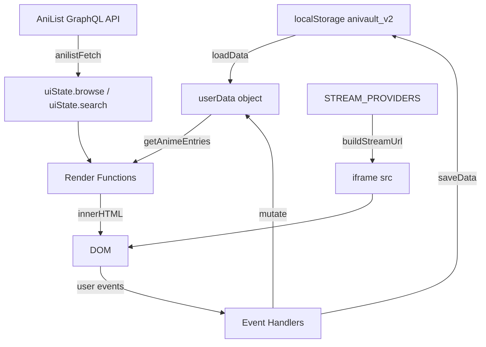

# Design Document: AniVault Redesign

## Overview

AniVault is a privacy-first, browser-based anime streaming and tracking platform. This redesign overhauls the visual design with a glassmorphism aesthetic, replaces broken streaming providers with verified functional ones, and introduces a modular provider system — all while preserving the existing localStorage-based library data and the single-file architecture (HTML + CSS + JS).

The redesign is a **progressive enhancement** of the existing codebase: the same `index.html`, `app.js`, and `styles.css` files are updated in-place. No build tools, no bundlers, no backend. The app continues to run by opening `index.html` in a browser or serving it with a simple static server.

### Key Design Goals

1. **Visual overhaul** — glassmorphism cards, cinematic hero section, dark immersive theme, smooth transitions
2. **Provider reliability** — remove broken providers, add 3+ verified functional ones, modular config
3. **Data preservation** — zero changes to the `anivault_v2` localStorage schema
4. **Anime-only focus** — all UI copy, search, and providers remain anime-specific
5. **Accessibility** — WCAG AA contrast, keyboard navigation, ARIA labels throughout

---

## Architecture

AniVault is a **single-page application (SPA)** with no build step. All logic lives in one JavaScript file rendered into a single `<div id="app">` root element. The architecture follows a simple render-on-state-change pattern:

```
User Interaction
      │
      ▼
Event Handler (handleClick / handleInput / handleKeydown)
      │
      ▼
State Mutation (uiState / userData)
      │
      ▼
renderApp() → innerHTML replacement
      │
      ▼
DOM (re-rendered subtree)
```

### Module Boundaries (logical, not file-based)

```
app.js
├── Constants & Config
│   ├── STORAGE_KEY, NAV_TABS, STATUS_OPTIONS, STATUS_LABELS
│   ├── GraphQL query strings (SEARCH_QUERY, BROWSE_QUERY, etc.)
│   └── STREAM_PROVIDERS  ← primary target of provider redesign
│
├── State
│   ├── userData (library, persisted to localStorage)
│   └── uiState (ephemeral UI state)
│
├── Data Layer
│   ├── normalizeEntry / normalizeLibrary
│   ├── loadData / saveData / reconcileLibrary
│   └── AniList API calls (anilistFetch)
│
├── Render Layer
│   ├── renderApp() — root orchestrator
│   ├── renderTopNav / renderMobileTabs
│   ├── renderHome / renderLibrary / renderBrowse / renderSearch / renderStats
│   ├── renderWatchView  ← uses STREAM_PROVIDERS
│   └── Component helpers (renderPosterCard, renderContinueCard, etc.)
│
├── Provider System  ← redesigned
│   ├── STREAM_PROVIDERS array (modular config)
│   ├── buildStreamUrl(entry, episode, language, providerIndex)
│   └── Fallback timer logic (streamFallbackTimer)
│
└── Event Handlers
    ├── handleClick / handleInput / handleKeydown / handleMessage
    └── Fullscreen helpers
```

### Data Flow Diagram



---

## Components and Interfaces

### 1. Navigation Component

The top navigation bar uses a **pill-style centered nav** with glassmorphism backdrop blur. It is fixed at the top and contains:

- Brand logo (gradient text "AniVault")
- Centered pill nav with tab links (Home, Library, Browse, Search, Stats)
- Right-side actions: inline search, Export, Import, Theme toggle, Settings
- Mobile: hamburger menu that opens a slide-down panel

**CSS approach:** `backdrop-filter: blur(28px) saturate(160%)` on `.topnav`, pill container uses `background: rgba(255,255,255,0.04)` with `border-radius: 40px`.

### 2. Hero Section Component (New)

A new `renderHero()` function renders a cinematic banner on the Home page. It displays a featured anime (most recently watched, or a random "watching" entry) with:

- Full-width banner image as background
- Gradient overlay (bottom-to-top dark fade)
- Large title (≥2.5em, font-weight 900)
- Subtitle (genre tags, year, episode count)
- Two CTA buttons: "▶ Watch Now" and "＋ Add to Library"
- Minimum height: 400px desktop, 300px mobile

```
┌─────────────────────────────────────────────────────────┐
│  [Banner Image — full width, object-fit: cover]         │
│                                                         │
│  ░░░░░░░░░░░░░░░░░░░░░░░░░░░░░░░░░░░░░░░░░░░░░░░░░░░░  │
│  ░░░░░░░░░░░░░░░░░░░░░░░░░░░░░░░░░░░░░░░░░░░░░░░░░░░░  │
│                                                         │
│  ANIME TITLE HERE                                       │
│  Action • Adventure • 2024 • 24 episodes               │
│                                                         │
│  [▶ Watch Now]  [＋ Add to Library]                     │
└─────────────────────────────────────────────────────────┘
```

**Design rationale:** The hero uses the existing `entry.banner` field from AniList data. If no banner is available, a CSS gradient using the accent color fills the background. This avoids any new API calls.

### 3. Glass Card Components

All card types receive glassmorphism treatment:

| Component | Glass Treatment |
|---|---|
| `.continue-card` | `backdrop-filter: blur(12px)` on overlay button, border glow on hover |
| `.poster-card` | `background: var(--glass-bg)`, border `rgba(255,255,255,0.07)` |
| `.discover-card` | Hover panel slides up with gradient overlay |
| `.stats-strip` | `backdrop-filter: blur(16px)`, translucent background |
| `.library-toolbar` | `backdrop-filter: blur(12px)` |
| `.watch-sidebar` | `backdrop-filter: blur(20px)` |

**Hover interaction:** All cards apply `transform: scale(1.03-1.05) translateY(-4px)` with `box-shadow: 0 20px 50px rgba(0,0,0,0.65), 0 0 0 1px rgba(124,58,237,0.3)` and `border-color: rgba(124,58,237,0.4)` on `:hover`. Transition duration: 300ms cubic-bezier(0.4, 0, 0.2, 1).

### 4. Provider Manager Interface

The `STREAM_PROVIDERS` array is the single source of truth for all streaming providers. Each entry conforms to this schema:

```javascript
{
  name: string,           // Display name shown in UI
  active: boolean,        // Toggle without removing config
  idType: "anilist" | "slug",  // What ID format buildUrl expects
  buildUrl: (entry, ep, lang) => string,  // URL builder function
  notes: string,          // Documentation / known limitations
}
```

The `buildUrl` function always receives:
- `entry` — the full normalized anime entry object (has `.anilistId`, `.title`, `.titleEnglish`)
- `ep` — episode number (integer)
- `lang` — `"sub"` or `"dub"`

### 5. Watch View Layout

The watch view uses a three-column CSS Grid layout:

```
┌──────────────┬──────────────────────────┬──────────────┐
│  Left        │                          │  Right       │
│  Sidebar     │    iframe Player         │  Sidebar     │
│  280px       │    (flex: 1)             │  300px       │
│              │                          │              │
│  - Title     │    [video embed]         │  - Episodes  │
│  - Sub/Dub   │                          │  - Groups    │
│  - Synopsis  │    [provider controls]   │              │
│  - Rating    │                          │              │
│  - Progress  │                          │              │
└──────────────┴──────────────────────────┴──────────────┘
```

On mobile (< 768px), the layout collapses to a single column: player on top, then left sidebar content, then episode list.

### 6. Toast Notification System

Toasts appear in `#toastZone` (fixed, top-right). Each toast has:
- Title (success/error/info)
- Message text
- Auto-dismiss after 4 seconds
- Slide-in animation from right

### 7. Settings Overlay

A modal overlay for:
- Accent color picker (8 preset colors)
- Compact mode toggle
- Reduced motion toggle
- Theme toggle (dark/light)

---

## Data Models

### Anime Entry (localStorage schema — unchanged)

```javascript
{
  id: number,              // AniList media ID (primary key)
  anilistId: number,       // Same as id (legacy field, kept for compat)
  title: string,           // Romaji title
  titleEnglish: string,    // English title (may be empty)
  cover: string,           // Cover image URL
  banner: string,          // Banner image URL (used by hero section)
  episodes: number,        // Total episode count (0 = unknown/ongoing)
  status: StatusOption,    // One of STATUS_OPTIONS
  episodesWatched: number, // Progress counter
  language: "sub" | "dub",
  rating: number,          // 0-10 user rating
  dateAdded: number,       // Unix timestamp ms
  lastWatched: number,     // Unix timestamp ms
  completedAt: number,     // Unix timestamp ms
  notes: string,
  genres: string[],
  year: number,
  sessionLog: number[],    // Array of watch timestamps
  averageScore: number,    // AniList community score
}
```

**Schema compatibility guarantee:** The `normalizeEntry()` function coerces all fields to their expected types. No new fields are added to the schema in this redesign. The `__meta` key stores theme preference.

### UI State (ephemeral, not persisted)

```javascript
uiState = {
  theme: "dark" | "light",
  accentColor: string,     // CSS hex color
  compactMode: boolean,
  reducedMotion: boolean,
  navMenuOpen: boolean,
  navSearchOpen: boolean,
  library: { filter, sort, query },
  browse: { mode, genre, results, loading, error, page, hasMore, ... },
  search: { query, results, loading, error, filters },
  watch: {
    currentProvider: number,  // Index into STREAM_PROVIDERS
    forceFallback: boolean,
    streamLoaded: boolean,
    sidebarCollapsed: boolean,
    episodeGroupIndex: number,
    lastEndedKey: string,
  },
  overlay: null | "settings" | "detail" | "import" | "export",
}
```

### Stream Provider Config (redesigned)

```javascript
// STREAM_PROVIDERS array — single source of truth
[
  {
    name: "MegaPlay",
    active: true,
    idType: "anilist",
    // AniList ID-based: works for most series, may fail for OVAs/movies
    buildUrl: (entry, ep, lang) =>
      `https://megaplay.buzz/stream/ani/${entry.anilistId}/${ep}/${lang}`,
    notes: "Confirmed working. Supports sub/dub via lang param.",
  },
  {
    name: "VidLink",
    active: true,
    idType: "anilist",
    // AniList ID-based embed
    buildUrl: (entry, ep, lang) =>
      `https://vidlink.pro/anime/${entry.anilistId}/${ep}/${lang}`,
    notes: "AniList ID-based. Generally reliable for popular series.",
  },
  {
    name: "VidSrc",
    active: true,
    idType: "anilist",
    // Uses numeric dub flag (1=dub, 0=sub)
    buildUrl: (entry, ep, lang) =>
      `https://vidsrc.icu/embed/anime/${entry.anilistId}/${ep}/${lang === "dub" ? 1 : 0}`,
    notes: "AniList ID-based. Dub flag is numeric 0/1.",
  },
  {
    name: "AniPlay",
    active: true,
    idType: "anilist",
    // AniPlay embed — anime-focused provider
    buildUrl: (entry, ep, lang) =>
      `https://aniplay.co/embed/anime/${entry.anilistId}/${ep}`,
    notes: "Anime-focused. No explicit dub param; defaults to available audio.",
  },
  // --- REMOVED (non-functional) ---
  // VidStream: speculative URL, returns 404
  // VidCloud: domain does not resolve
  // VidNest: CORS block, no embed support
  // VidPlus: URL pattern unverified, no public docs
  // AniSuge (.ltd): domain blocks iframe embedding
  // AniSuge2 (.to): domain blocks iframe embedding
  // HiAnime: redirects to search page, not a direct embed
]
```

**Design rationale for provider selection:**
- MegaPlay is confirmed working per project requirements
- VidLink and VidSrc use the same AniList ID pattern as MegaPlay, making them low-risk additions
- AniPlay is an anime-specific provider with a clean embed URL pattern
- All removed providers either have CORS issues, unresolvable domains, or return non-embed pages

### Responsive Breakpoints

| Breakpoint | Width | Layout |
|---|---|---|
| Mobile | < 768px | Single column, stacked |
| Tablet | 768px – 1024px | Two-column grids |
| Desktop | > 1024px | Multi-column, full sidebar layout |

---

## Correctness Properties

*A property is a characteristic or behavior that should hold true across all valid executions of a system — essentially, a formal statement about what the system should do. Properties serve as the bridge between human-readable specifications and machine-verifiable correctness guarantees.*

### Property 1: Library data round-trip preservation

*For any* valid anime entry object stored in localStorage under `anivault_v2`, loading the data via `normalizeLibrary()` and then serializing it back via `JSON.stringify()` SHALL produce an object where all original fields (id, title, status, episodesWatched, rating, notes, genres, sessionLog) are present and equal to their original values.

**Validates: Requirements 12.1, 12.2, 12.4**

### Property 2: Entry normalization is idempotent

*For any* anime entry object (including malformed or partially-populated objects), applying `normalizeEntry()` twice SHALL produce the same result as applying it once — i.e., `normalizeEntry(normalizeEntry(x))` is deeply equal to `normalizeEntry(x)`.

**Validates: Requirements 12.2, 12.3**

### Property 3: Provider schema invariant

*For any* provider object in the `STREAM_PROVIDERS` array, the provider SHALL have a non-empty `name` string, a boolean `active` field, a callable `buildUrl` function, and a `notes` string — regardless of how many providers are added or removed from the array.

**Validates: Requirements 4.1, 6.1, 6.3**

### Property 4: Provider buildUrl returns a valid HTTPS URL for all valid inputs

*For any* active provider in `STREAM_PROVIDERS`, any anime entry with a positive integer `anilistId`, any episode number ≥ 1, and any language value of `"sub"` or `"dub"`, calling `provider.buildUrl(entry, ep, lang)` SHALL return a non-empty string that begins with `"https://"`.

**Validates: Requirements 5.3, 6.5**

### Property 5: Provider fallback cycles through all active providers

*For any* starting provider index and any number of consecutive fallback events, the provider index SHALL advance to the next active provider in order and wrap back to 0 after the last active provider — such that after exactly N fallbacks (where N equals the number of active providers), the index returns to its original starting value.

**Validates: Requirements 7.1, 7.4**

### Property 6: Search debounce fires exactly once per input burst

*For any* sequence of search input events where all events occur within a 350ms window, the AniList API SHALL be called exactly once — after the 350ms timer expires following the final event in the burst.

**Validates: Requirements 9.4**

### Property 7: Status normalization rejects invalid values

*For any* entry object where the `status` field contains a string value not present in `STATUS_OPTIONS`, `normalizeEntry()` SHALL coerce the status to `"untracked"` rather than storing the invalid value.

**Validates: Requirements 12.2, 12.4**

### Property 8: Text contrast meets WCAG AA across all themes

*For any* text element rendered by the UI (in both dark and light themes), the computed contrast ratio between the text color and its effective background color SHALL be at least 4.5:1 for normal-sized text and at least 3:1 for large text (≥ 18px regular or ≥ 14px bold).

**Validates: Requirements 2.4, 15.3**

---

## Error Handling

### Provider Failures

| Scenario | Behavior |
|---|---|
| Provider iframe fails to load within 120s | Auto-fallback to next active provider; toast notification shown |
| All providers exhausted | `forceFallback = true`; fallback card shown with manual HiAnime search link |
| `buildUrl` returns empty string | Fallback card shown immediately without starting timer |
| Provider index out of bounds | Clamp to `STREAM_PROVIDERS[0]` |

### AniList API Failures

| Scenario | Behavior |
|---|---|
| Network error | `uiState.browse.error` / `uiState.search.error` set; error message rendered in place of results |
| Rate limit (429) | Same as network error; no retry logic (user can manually retry) |
| Empty results | "No results found" empty state rendered |
| Malformed response | Graceful fallback to empty array; no crash |

### localStorage Failures

| Scenario | Behavior |
|---|---|
| `JSON.parse` throws | `normalizeLibrary({})` called; empty library; error toast shown |
| `localStorage.setItem` throws (quota exceeded) | Error caught silently; data not saved; toast shown |
| Corrupted entry fields | `normalizeEntry()` coerces all fields; invalid entries (no valid id) are dropped |

### Image Loading Failures

All `` elements use `onerror` to hide broken images gracefully. Cards without images fall back to a CSS gradient placeholder using the accent color.

---

## Testing Strategy

### Unit Tests

Unit tests cover specific examples and edge cases for pure functions. Key targets:

- `normalizeEntry()` — valid entry, missing fields, invalid status, negative numbers, null/undefined inputs
- `normalizeLibrary()` — empty object, corrupted entries, `__meta` preservation, mixed valid/invalid entries
- `buildStreamUrl()` — each provider, sub/dub variants, edge case IDs, out-of-bounds provider index
- `filterByText()` — exact match, partial match, case-insensitive, empty query, special characters
- `getProgressPercent()` — 0 episodes, partial progress, completed (100%), invalid inputs
- `getPlayableEpisodeCount()` — known total, unknown total (ongoing), zero watched, negative values
- `escapeHtml()` — all five HTML special characters, empty string, non-string input, nested tags

### Property-Based Tests

Property-based tests use [fast-check](https://github.com/dubzzz/fast-check) for JavaScript with a minimum of 100 iterations per property.

Each test is tagged with:
**Feature: anivault-redesign, Property {N}: {property_text}**

| Property | Test Description | Generator |
|---|---|---|
| P1: Library round-trip | Serialize → deserialize → compare all fields | Random anime entry objects with all valid fields populated |
| P2: Normalization idempotence | `normalize(normalize(x)) === normalize(x)` | Arbitrary objects including malformed, partial, and over-populated entries |
| P3: Provider schema invariant | All providers have required fields | Iterate over STREAM_PROVIDERS array |
| P4: Provider URL validity | `buildUrl` returns `https://` string | Random entries × all active providers × ["sub","dub"] × random episode numbers |
| P5: Provider fallback cycling | Index wraps after N steps | Random starting index, simulate N fallback events |
| P6: Search debounce | API called once per burst | Random keystroke sequences with timing simulation (fake timers) |
| P7: Status coercion | Invalid status → "untracked" | Random strings as status values, including empty, numeric, special chars |
| P8: Text contrast | Contrast ratio ≥ 4.5:1 (normal) or 3:1 (large) | Random text/background color pairs from CSS variables |

### Integration Tests

Integration tests verify the wiring between components with 1-3 representative examples:

- Library loads from localStorage and renders correctly in the DOM
- AniList search returns results and they appear in the search results grid
- Provider fallback timer triggers after 120s and switches provider (using fake timers)
- Export produces valid JSON that can be re-imported without data loss
- Fullscreen mode persists when switching episodes
- Toast notifications appear and auto-dismiss after 4 seconds

### Accessibility Tests

- **Automated:** axe-core or similar for ARIA, contrast, label coverage, keyboard navigation
- **Manual:** keyboard-only navigation through all tabs, watch view, and overlays
- **Manual:** screen reader walkthrough of the home page, library, and watch view
- **Manual:** verify focus indicators are visible on all interactive elements

### Visual Regression

- Snapshot tests for the hero section at 320px, 768px, 1440px viewports
- Snapshot tests for card hover states (continue-card, poster-card, discover-card)
- Snapshot tests for dark and light themes
- Snapshot tests for glassmorphism effects (backdrop-filter applied correctly)

### Performance Checks

- Lighthouse audit targeting ≥ 90 Performance score on desktop
- Verify CSS animations use `transform` and `opacity` only (no layout-triggering properties like `width`, `height`, `top`, `left`)
- Verify images outside viewport are not loaded on initial render (lazy loading)
- Verify debounce is applied to scroll event handlers (no more than 1 call per frame)
